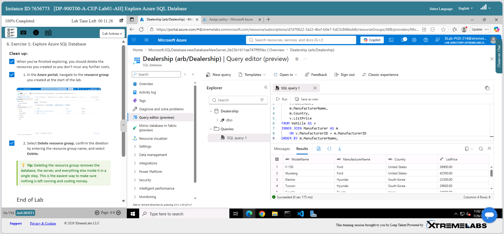
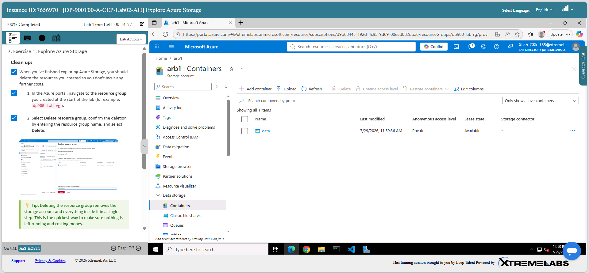
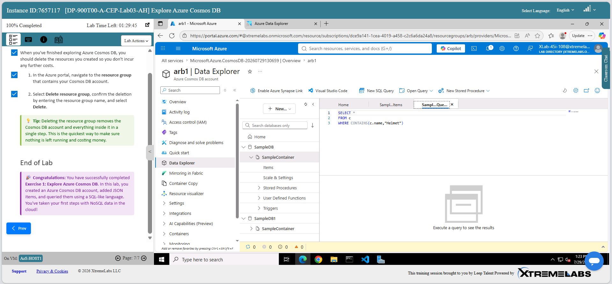
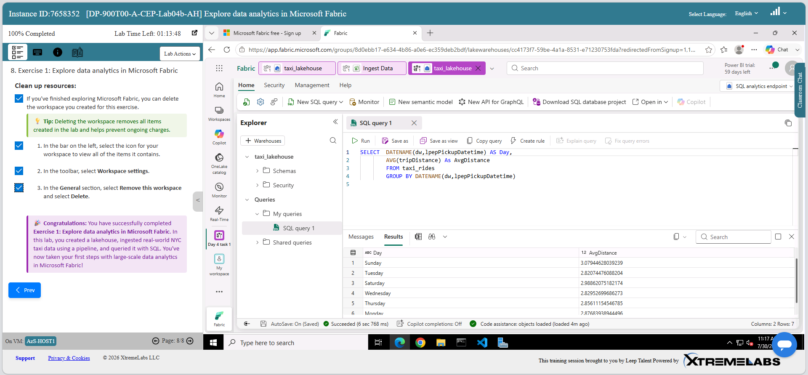
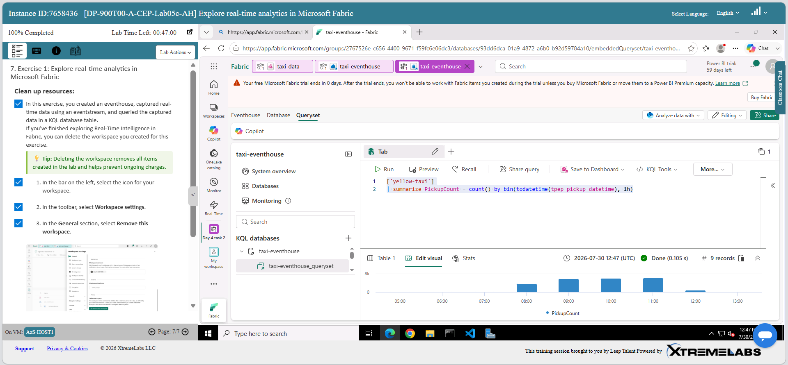
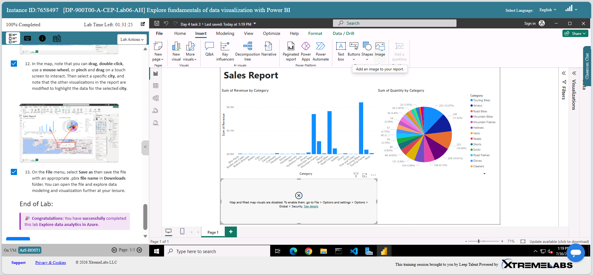

# ☁️ Azure Data Fundamentals: Cloud Concepts to Real-Time Analytics

Week 5 project from the Leep Data Technician Skills Bootcamp, based on Microsoft's DP-900 (Azure Data Fundamentals) curriculum. Covers core cloud computing concepts, hands-on labs across Azure's relational, non-relational, and analytics services, and a full written proposal for migrating a small business onto Azure.

## 📝 Overview

- Researched core cloud computing concepts: service models (IaaS/PaaS/SaaS), deployment models (public/private/hybrid/community cloud), and cost estimation with the Azure Pricing Calculator
- Completed six hands-on XtremeLabs exercises covering Azure SQL Database, Azure Storage, Azure Cosmos DB, Microsoft Fabric Lakehouse, real-time analytics with Eventstreams, and Power BI
- Advised a fictional client ("DataCore Enterprises") on cloud service model, cost estimation, and risk as a cloud consulting exercise
- Wrote a 6-section Azure migration proposal for **Paws & Whiskers**, a growing pet shop moving off manual spreadsheets

## 🧠 Skills Gained

- **Cloud computing fundamentals** – comparing IaaS/PaaS/SaaS and public/private/hybrid/community cloud, choosing the right service model for a client's requirements, and estimating cost with the Azure Pricing Calculator
- **Relational data with Azure SQL Database** – querying a live Azure SQL Database in the Query Editor, including `INNER JOIN` and `ORDER BY`
- **Non-relational data with Azure Storage** – creating an Azure Storage Account and a Blob container
- **Non-relational data with Azure Cosmos DB** – creating a Cosmos DB account, adding JSON items, and querying them with Cosmos DB's SQL-like query language, including `WHERE`/`CONTAINS`
- **Analytical workloads with Microsoft Fabric Lakehouse** – building a Lakehouse, ingesting real-world data via a pipeline, and running SQL with `SELECT`, aggregate functions, and `GROUP BY`
- **Real-time data ingestion with Eventstreams** – capturing streaming data with an Eventstream into an Eventhouse, then querying it with KQL (`summarize`, `count()`, `bin()`)
- **Data visualization with Power BI** – building a sales report with bar and pie charts broken down by product category
- **Relational data modelling** – designing a 5-entity schema (`Customer`, `Pet`, `Product`, `Transaction`, `TransactionDetails`) with primary/foreign keys, resolving a many-to-many relationship with a junction table, and mapping it to a star schema for analytics
- **Data storage formats and security** – recommending CSV/JSON/Parquet for different data shapes, and applying access control, MFA, and encryption at rest/in transit
- **Backup and disaster recovery planning** – distinguishing geo-redundancy (Azure GRS) from scheduled backup (Azure Backup) from full regional failover (Azure Site Recovery)
- **Data protection law** – applying UK GDPR, the Data Protection Act 2018, and PCI DSS to a business handling customer and payment data

## 🗂️ Task Breakdown

### Task 1 — Cloud Computing Fundamentals
Researched service models, deployment models, and cost estimation.

> **IaaS** – you rent the raw hardware (servers, storage, networking) but install and manage everything on top. *Example: moving an old on-premises server to the cloud as-is.*
> **PaaS** – the provider manages the OS, runtime, and infrastructure; you just write and deploy code. *Example: a developer building an app without managing servers.*
> **SaaS** – a fully finished application you just log into and use. *Example: everyday business tools.*

Estimated a sample enterprise BI pipeline with the Azure Pricing Calculator at **$7,799/month**, including an Azure SQL Database component at ~$290/month.

### Task 2 — Cloud Consulting Scenario: DataCore Enterprises
Advised a fictional client wanting to move internal database servers to the cloud while keeping full control over operating systems and storage.

- **Service model recommended:** IaaS, since the client wants full infrastructure control and already has IT staff
- **Cost estimation:** Azure Pricing Calculator
- **Benefits:** pay only for what's used instead of buying hardware upfront; faster to build and launch new applications
- **Risks:** data security exposure if the database holds confidential customer details; a skills gap, since on-prem IT staff need retraining for cloud-specific tools and security models

### Task 3 — XtremeLabs: Azure SQL Database
Explored Azure SQL Database's Query Editor against a sample "Dealership" database, joining vehicles to their manufacturers.

```sql
SELECT v.ModelName, m.ManufacturerName, m.Country, v.ListPrice
FROM Vehicle AS v
INNER JOIN Manufacturer AS m
    ON v.ManufacturerID = m.ManufacturerID
ORDER BY m.ManufacturerName;
```



### Task 4 — XtremeLabs: Azure Storage
Created an Azure Storage Account and a Blob container for unstructured data.



### Task 5 — XtremeLabs: Azure Cosmos DB
Created a Cosmos DB account, added JSON items, and queried them using Cosmos DB's SQL-like query language — a first hands-on look at NoSQL data in the cloud.

```sql
SELECT *
FROM c
WHERE CONTAINS(c.name, "Helmet")
```



### Task 6 — XtremeLabs: Microsoft Fabric Lakehouse
Built a Lakehouse (`taxi_lakehouse`), ingested real-world NYC taxi trip data via a pipeline, and queried it with SQL to find average trip distance by day of week.

```sql
SELECT DATENAME(dw, lpepPickupDatetime) AS Day,
    AVG(tripDistance) AS AvgDistance
FROM taxi_rides
GROUP BY DATENAME(dw, lpepPickupDatetime)
```



### Task 7 — XtremeLabs: Real-Time Analytics with Eventstreams
Created an Eventhouse, captured real-time streaming data using an Eventstream, and queried the captured data with KQL — counting taxi pickups per hour.

```
['yellow-taxi']
| summarize PickupCount = count() by bin(todatetime(tpep_pickup_datetime), 1h)
```



### Task 8 — XtremeLabs: Data Visualization with Power BI
Built a sales report visualizing revenue and quantity sold by product category for a bike shop retail dataset.



### Task 9 — Azure Migration Proposal: Paws & Whiskers (Retail Case Study)
Wrote a full proposal recommending how a pet shop should move its sales, customer, and inventory data onto Azure.

**Data storage split:**

```
Structured data (customers, products, transactions) → Azure SQL Database
Unstructured data (photos, scanned invoices, vet certs) → Azure Blob Storage
```

**Relational data model:**

| Entity | Attributes |
|---|---|
| Customer | CustomerID (PK), CustomerName, Postcode |
| Pet | PetID (PK), CustomerID (FK), Age, LastAppointmentDate |
| Product | ProductID (PK), ProductName, Category, Quantity |
| Transaction | SalesID (PK), CustomerID (FK), SalesDate |
| TransactionDetails | DetailsID (PK), SalesID (FK), ProductID (FK), Quantity, SalesAmount |

`Transaction` and `TransactionDetails` were split into separate entities to solve a many-to-many problem: one transaction can include several different products, and a single foreign key column can't reference more than one product per row. This mirrors the classic order/order-lines pattern, and doubles as a star schema — `Transaction`/`TransactionDetails` as the fact table, `Customer`/`Pet`/`Product` as dimension tables — ready to feed Azure Synapse Analytics.

**Format and tooling recommendations:**

| Need | Recommendation | Why |
|---|---|---|
| Migrating existing spreadsheets | CSV | Plain-text version of the same row/column shape already in use |
| Variable-structure records (e.g. pets with different numbers of vaccination entries) | JSON | Nested key-value format handles variation a fixed spreadsheet column can't |
| Sales history for analytics | Parquet | Columnar format — much faster for aggregate queries over large volumes |
| Sales trend analysis | Azure Synapse Analytics | SQL/Spark queries over structured historical data (descriptive/diagnostic) |
| Customer behaviour prediction | Azure Machine Learning | Predictive models from the same historical data (predictive/prescriptive) |
| Automating data entry | Azure Data Factory | Scheduled pipelines to pull till/POS data in automatically, cutting manual re-typing and error |

Also distinguished Azure's Geo-Redundant Storage (continuous replication — protects against losing a data centre, but *also* replicates mistakes) from Azure Backup (scheduled point-in-time snapshots you can actually restore from), and covered GDPR, the Data Protection Act 2018, and PCI DSS as they apply to a business handling customer and card payment data.

## 🛠️ Tools

Microsoft Azure (SQL Database, Storage, Cosmos DB, Synapse Analytics, Machine Learning, Data Factory, Backup, Site Recovery), Microsoft Fabric (Lakehouse, Eventstreams, Eventhouse, KQL), Power BI, Azure Pricing Calculator

## 🎓 About

Completed as part of Week 5 (Azure) of the [Leep Talent Data Technician Skills Bootcamp](https://leepgroup.com), August 2026.
